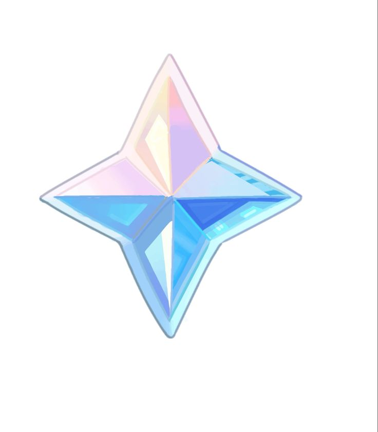

## Day 9 || Project:Silent Auction Program
- Final project as of day 9.

## Table of contents

- [Overview](#overview)
  - [The challenge](#the-challenge)
- [Notes](#notes)
  - [Built with](#built-with)
  - [What I learned](#what-i-learned)

## Overview

### The challenge

- Create a program to ask for bids and print out the highest bidder, also don't reveal the bids of other users.

## Notes

- Changed bidding currency to Primogem!!

### Built with

- Python

### What I learned
- Dictionaries 
- Nesting