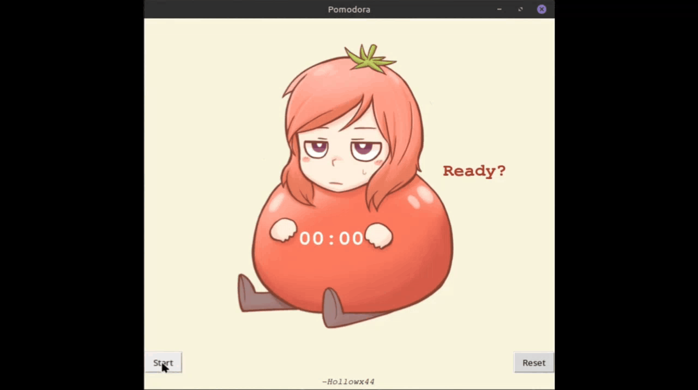

# Day 28: Project - Pomodoro Timer
This is my project as of Day 28.
## Table of contents
- [Overview](#overview)
  - [The challenge](#the-challenge)
  - [Showcase](#showcase)
  - [Built with](#built-with)
  - [What I learned](#what-i-learned)

## Overview

### The challenge

- Create a Pomodoro GUI countdown timer 

### Showcase

### Built with

- Python
- Tkinter

### What I learned
- Review Tkinter, Canvas Widget, Adding Images to Tkinter
- UI
- Dynamic Typing 

 