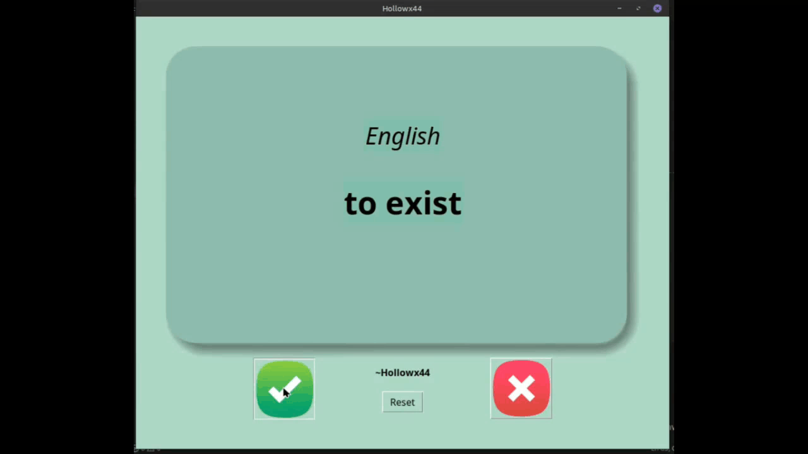
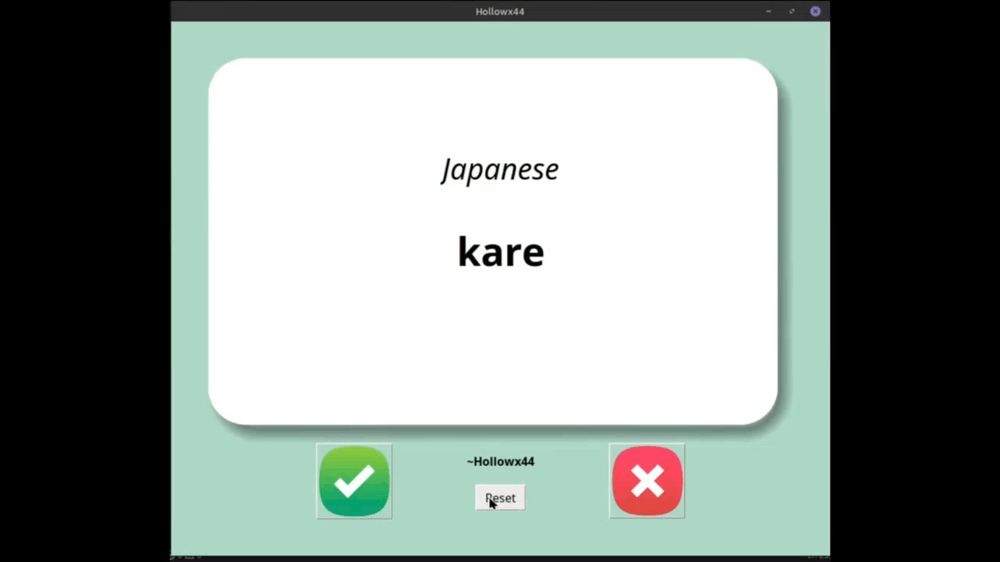

# Day 31 || Capstone Project:Flash Card Program
This is my final project as of day 31, so far my best project.
## Table of contents

- [Overview](#overview)
  - [The challenge](#the-challenge)
  - [Showcase](#showcase)
  - [Built with](#built-with)
  - [What I reviewed](#what-i-reviewed)

## Overview

### The challenge

- Create a flash card program to learn words from a specific language.

### Showcase
- Shifted the entire project from French to Japanese.

- Added a reset functionality to start fresh anytime.

### Built with

- Python
- Tkinter

### What I reviewed
- Exception handling 
- Reading CSVs
- Pandas
- Updating data globally

